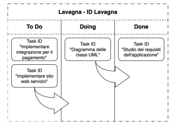

# SPECIFICHE PROGETTO - RETI INFORMATICHE cod. 545II, 9CFU. A.A. 2025/2026
Si richiede di implementare un’applicazione distribuita che implementi il metodo di gestione del
lavoro basato su kanban. \
Kanban è un metodo basato su delle card (ognuna identifica uno specifico task da portare a
compimento) che si muovono su una lavagna, focalizzato alla visualizzazione del lavoro per
migliorarne il flusso, che viene suddiviso in colonne (es. To do → Doing → Done).

## Descrizione
Realizzare una kanban, che permetta ai lavoratori (utenti) di interagire su di essa alla pari, e di
avere una visione sullo stato delle attività in corso ma anche di spostare e aggiungere le card. Per
interagire con la lavagna, sono definiti una serie di comandi, che tutti gli utenti devono
implementare. \
Le entità cardine del progetto sono la lavagna e gli utenti.

La lavagna, raggiungibile alla porta 5678 è identificata da:
- ID
- Colonne
- Card

All’interno della lavagna sono presenti le card (almeno 10), identificate da:
- ID
- Colonna
- Testo attività
- Utente (porta) che la\l’ha implementa (“Doing”) \implementata (“Done”)
- Timestamp ultima modifica

Gli utenti (almeno 4), sono identificati dal loro numero di porta. Avranno quindi porte
incrementali a partire dalla 5679, e comunicheranno con la lavagna e tra di loro. La
comunicazione con la lavagna è la prima operazione che un utente deve eseguire, e rappresenta
una sorta di registrazione, così la lavagna sa quanti utenti sono disponibili in un dato momento

#### Interazioni da implementare per gli studenti dopo registrazione
La lavagna comunicherà con gli utenti per assegnare ad ognuno una card (attività) nella colonna
“To Do”. L’utente risponderà confermando la gestione dell’attività e la lavagna sposterà la card in
“Doing”. Prima di comunicare il completamento dell’azione alla lavagna, gli utenti devono
scambiarsi un messaggio con lo scopo di revisionare l’attività, quindi ci devono essere almeno
due utenti prima che una attività possa essere terminata, e la sua terminazione comunicata alla
lavagna che poi sposterà la carta in “Done”.

#### Comandi (che utente e lavagna possono eseguire sia per flusso logico che da riga di comando):
- **CREATE_CARD**: utenti comunicano alla lavagna la creazione di una nuova card, assegnandole
ID, Colonna e testo attività.
- **HELLO**: utenti notificano la loro presenza (registrazione) alla lavagna. La lavagna salverà le loro
porte e terrà il conto degli utenti presenti.
- **QUIT**: utenti notificano la loro uscita alla lavagna. La lavagna cancellerà la loro porta e
decrementerà il counter degli utenti presenti. Se l’utente che ha eseguito QUIT aveva una card
in “Doing”, questa verrà spostata in To Do, e riassegnata a qualche utente, secondo le due
modalità definite.
- **MOVE_CARD**: viene eseguito dalla lavagna ogni volta che riceve un’informazione da parte degli
utenti, sia che l’utente comunichi di avere in gestione una attività sia che abbia terminato
l’esecuzione di una attività.
- **SHOW_LAVAGNA**: viene stampata la lavagna, con le colonne e le card assegnate alla giusta
colonna.
- **SEND_USER_LIST**: la lavagna manda la lista delle porte degli utenti
- **PING_USER**: per le card che sono in “Doing” da più di un certo tempo, la lavagna cerca di
contattare l’utente. Se l’utente non risponde entro un certo tempo, la card viene rimessa in “To
Do”.
- **PONG_LAVAGNA**: L’utente risponde al ping della lavagna. Questo identifica il fatto che sta
ancora eseguendo l’attività.

/**/
- **HANDLE_CARD**: la lavagna invia, in ordine di porta, ad ogni utente connesso una card della
colonna “To Do”. Questo comando, oltre alla card, include la lista delle porte degli utenti
presenti (escluso il destinatario del messaggio), e il numero degli utenti presenti.
- **ACK_CARD**: l’utente conferma di aver ricevuto l’assegnazione dell’attività, così la lavagna può
spostare la card nella colonna “Doing”.
- **REQUEST_USER_LIST**: Prima di mandare in review un’attività completata, l’utente chiede la
lista delle porte aggiornata alla lavagna e il numero di utenti.
- **REVIEW_CARD**: l’utente, dopo aver completato l’attività assegnatagli dalla lavagna, si scambia
questo messaggio con gli altri utenti, per ottenere da tutti gli altri una revisione dell’attività e
approvarne la terminazione.
- **CARD_DONE**: l’utente al quale è assegnata la card, dopo aver ricevuto la review da tutti gli altri
utenti, comunica che l’attività nella card è terminata.

Per l'implementazione, scegliere i protocolli di comunicazione, le strutture dei pacchetti, le
modalità di scambio dei dati (text o binary), e la gestione dei socket dipendentemente da aspetti
che si ritengono congrui all'applicazione descritta. Le considerazioni fatte per prendere tutte
queste decisioni devono essere spiegate in una documentazione da consegnare assieme ai
sorgenti.

## Documentazione
L’applicazione distribuita deve implementare quanto descritto in “Descrizione”. Le scelte
progettuali devono essere spiegate in una relazione di non più di 2 pagine usando, all’occorrenza,
anche figure e schemi intuitivi. Evitare considerazioni ovvie o che non aggiungano informazioni
effettive su dettagli implementativi. \
Nella relazione devono essere messi in luce, in modo critico, potenziali pregi e difetti delle scelte
fatte. Se la documentazione consegnata contiene più di due pagine, la valutazione del progetto
avverrà considerando solo le prime due. \
**ATTENZIONE**: \
Progetti con documentazioni contenenti solo le scelte fatte, senza un'analisi critica, non
saranno considerati sufficienti.
Progetti per i quali nella documentazione non sono chiare le operazioni per compilare non
saranno considerati sufficienti. 

## Schema funzionamento applicazione
La lavagna viene mandata in esecuzione sull’host come segue: \
./lavagna

Appena mandata in esecuzione, mostra a video lo stato della lavagna, con le card nella colonna
giusta (all’inizio tutto in “To Do”). Ad ogni spostamento di una card, aggiorna la visualizzazione
della lavagna (SHOW_LAVAGNA). \
Alla ricezione di un “HELLO” da parte di un utente, registra in una struttura dati la porta dell’utente
e aggiorna il contatore degli utenti connessi. Alla ricezione di un “QUIT” da parte di un utente,
rimuove porta e aggiorna il contatore degli utenti connessi. \
Quando riceve informazioni dagli utenti (ACK_CARD o CARD_DONE), usa il comando
MOVE_CARD per spostare la card nella colonna corretta. Se una card è nella colonna “To Do” per
più di un certo tempo (es: 1.30min), la lavagna manda PING_USER, e se non riceve
PONG_LAVAGNA entro 30s, sposta la card in “To Do”, assumendo che l’utente si è disconnesso
inaspettatamente.

Dal momento in cui viene rilevato un utente, gli viene mandata la card da gestire (HANDLE_CARD)
per la prima card in “To Do”. Questa operazione verrà ripetuta ogni volta che un utente ha
terminato una card e ci sono ancora card disponibili.
Dopo un certo tempo (si può usare la sleep(s) [#include<unistd.h>] nell’utente), gli utenti fanno
partire una fase di review prima di poter considerare l’attività terminata.

Un utente è mandato in esecuzione sull'host come segue: \
./utente porta

Dove porta è la porta dell’utente, che parte da 5679 e viene incrementata per ogni nuovo
utente. Gli utenti sanno che la lavagna è alla porta 5678.
La prima operazione che compie un utente è quella di registrarsi alla lavagna con il messaggio
“HELLO”. Quando deciderà di smettere di partecipare all’esecuzione delle attività lo deve
comunicare attraverso il comando “QUIT”

Ad ogni utente viene assegnata una card dalla lavagna con HANDLE_CARD, e ogni utente notifica
corretta ricezione alla lavagna con ACK_CARD. Dopo un certo intervallo di tempo, imposto
attraverso una sleep(), l’utente, prima di iniziare la fase di revisione, chiederà alla lavagna con
REQUEST_USER_LIST, la lista aggiornata degli utenti attualmente presenti. Manderà un
REVIEW_CARD ad ognuno di essi. Assumiamo che i giudizi in review siano sempre positivi (1), e
quindi dopo aver raccolto tutti i giudizi, l’utente comunicherà alla lavagna CARD_DONE

Per semplicità, tutte le componenti di questa applicazione distribuita, sono eseguite sullo stesso
host. Per questo, i comandi di avvio non necessitano di un parametro per specificare l'IP (che
sarà sempre 127.0.0.1).

## REQUISITI
- Se nella documentazione non sono presenti le informazioni richieste nel paragrafo
“Documentazione”, il progetto verrà valutato non sufficiente.
- È ammessa una sola consegna ad appello. Attenzione alla correttezza dei file consegnati,
controllare che ci siano tutti, che siano l’ultima versione sviluppata, che funzionino nella
macchina virtuale del corso, altrimenti il progetto, per mancanza di file (o perché alcuni
caratteri speciali introdotti da Windows ne alterano il comportamento), sarà valutato non
sufficiente.
- I dati sono scambiati tramite socket. Se non si definisce un formato di messaggio, prima di ogni
scambio, il ricevente deve essere informato su quanti byte leggere dal socket.
- Per gestire le varie informazioni, è possibile usare strutture dati a piacere. Gli aspetti che non
sono dettagliatamente specificati in questo documento possono essere implementati
liberamente.
- Il codice deve essere indentato e commentato in ogni sua parte: significato delle variabili,
processazioni, ecc. I commenti possono essere evitati nelle parti banali del codice. 